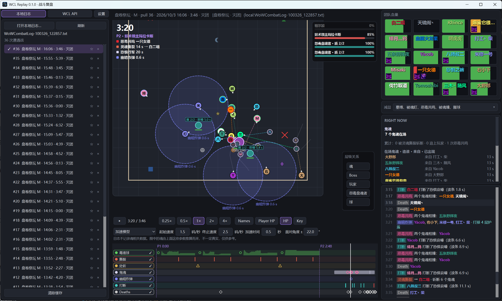

# WCL Replay

魔兽世界战斗日志与 [Warcraft Logs](https://www.warcraftlogs.com/) 回放工具。在地图上重放站位和标记，并按首领拆开机制，方便复盘灭团。



## 下载

发布包面向 Windows，不需要安装 Python。

到 [Releases](https://github.com/AriesXiaoS/wcl-replay/releases) 下载最新的 Windows 压缩包，解压后运行文件夹里的 `wcl-replay.exe`。可执行文件依赖同目录下的其余文件，使用时请保持这个目录完整。

## 功能

- 打开本地 `WoWCombatLog.txt`，按战斗轮次回放
- 粘贴 Warcraft Logs 报告链接，拉取其中一场战斗
- 地图上显示玩家、首领、团队标记、血量和机制范围
- 时间轴、变速播放，以及沿轨迹回看的幽灵路径
- 团队框架上的首领减益，右侧的伤害、死亡和打断记录
- **盘卷祭坛** 有专门的机制图层和阶段时间轴。其他首领使用通用回放，包含站位、血量和事件记录

本地日志要能画出站位，游戏里需要开启高级战斗日志。

## 使用

### 本地战斗日志

左侧留在「本地日志」，打开 `WoWCombatLog.txt`。零售版通常在游戏目录的 `_retail_\Logs` 下。列表出来之后，点某一轮才会开始计算。

### Warcraft Logs

左侧切到「WCL API」，先点「API 设置」：

1. 打开 [Warcraft Logs API Clients](https://www.warcraftlogs.com/api/clients/)，新建一个 Client。
2. Redirect URL 填 `http://localhost`。
3. 把 Client ID 和 Client Secret 填进窗口。国服报告把 API 域名改成 `cn.warcraftlogs.com`。
4. 可以先点「测试连接」。保存后，把某一场的报告链接贴进输入框再查询。

Client ID 和 Secret 只存在本机，不会提交到这个仓库。查询会计入你自己的 API 额度。

## 从源码运行

需要已安装 [uv](https://docs.astral.sh/uv/)。Python 版本由仓库里的 `.python-version` 固定为 3.13，`uv sync` 会自行准备环境。

在仓库根目录：

```powershell
uv sync
uv run wcl-replay
```

也可以直接带上日志路径：

```powershell
uv run wcl-replay D:\Logs\WoWCombatLog.txt
```

检查与打包：

```powershell
uv run pytest
uv run ruff check .
uv run --no-dev --group package python tools/build_windows.py
uv run python tools/pack_windows.py
```

Windows 目录包生成在 `build/nuitka/wcl_replay_entry.dist/`，可执行文件是 `wcl-replay.exe`。`pack_windows.py` 把它打成 `build/wcl-replay-<版本>-windows.zip`，解压后的目录名是 `wcl-replay-<版本>`。这个压缩包可以放到 Releases。

首领注册、通用调参接口和观测/派生轨迹的用法见 [扩展首领分析](docs/extending.md)。

## 许可

作者：伐竹取道 (AriesXiao)

本软件以 [PolyForm Noncommercial License 1.0.0](LICENSE) 授权。个人、公会等非商业用途可以查看、使用、修改和分发。禁止出售、嵌入收费产品，或用于收费服务。完整条款见仓库根目录的 `LICENSE`。
